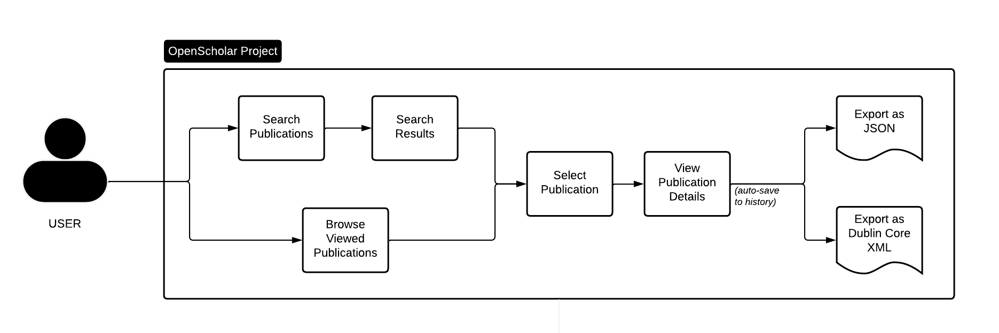
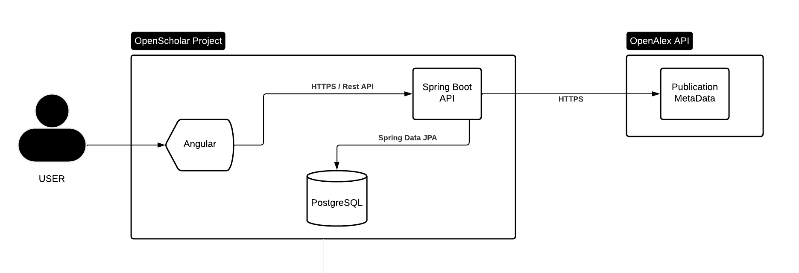

# OpenScholar
> A lightweight Spring Boot & Angular application for exploring scholarly publication metadata.

## Project Overview
OpenScholar is a lightweight web application designed to search, explore and visualize scholarly publication metadata.

The application allows users to search scientific publications through the OpenAlex API, browse recently viewed publications, inspect their metadata and export them in multiple formats.

This project was created as a learning exercise to explore concepts commonly found in institutional repositories, including metadata management, interoperability and scientific publication discovery.

It is not intended to reproduce an existing repository solution but rather to demonstrate the use of modern Java and Angular technologies in a realistic domain-driven context.

## Main Features

- Search scholarly publications
- View publication details
- Browse recently viewed publications
- Automatic history persistence
- Export metadata as JSON
- Export metadata as Dublin Core XML
- Responsive Angular interface

## User Flow
The following diagram illustrates the main user journey through the application.

## Architecture
The application follows a simple client-server architecture.

The Angular frontend communicates with a Spring Boot REST API, which retrieves publication metadata from the OpenAlex API and persists viewed publications in PostgreSQL.

## Technology Stack

### Backend

- Java 21
- Spring Boot 3.5
- Spring Web
- Maven

## References

Diagrams were created using Lucidchart.

## License

This project is licensed under the MIT License. See the [LICENSE](LICENSE) file for details.